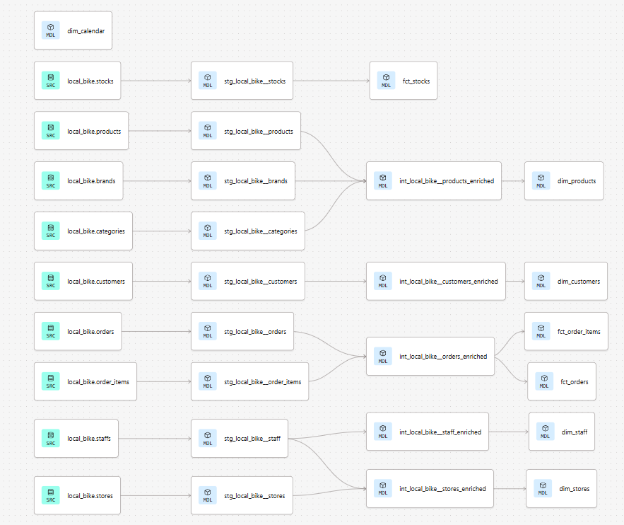
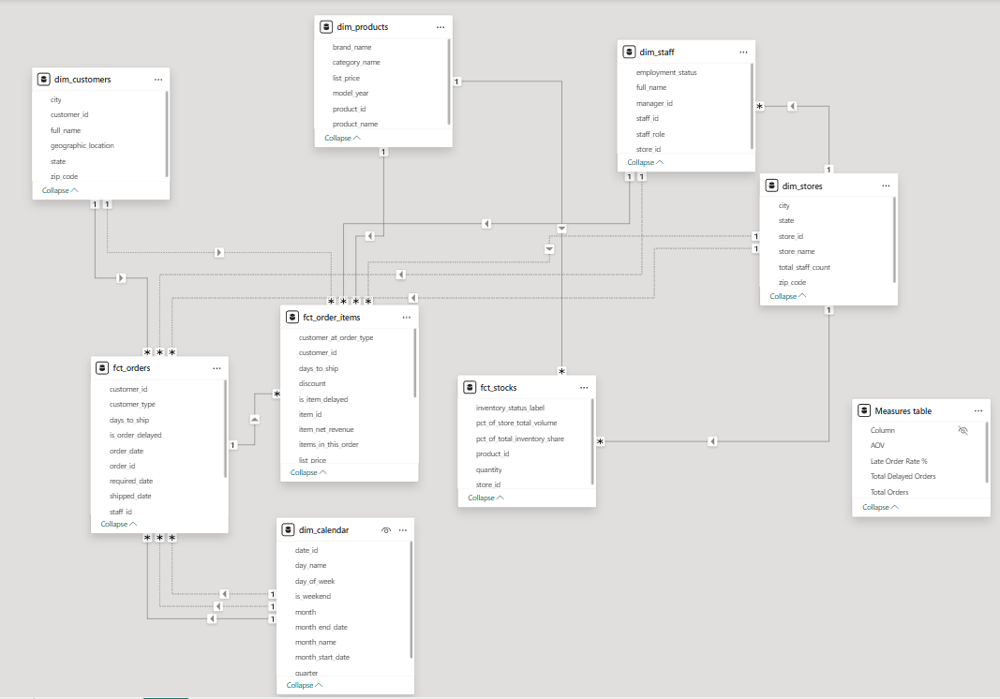
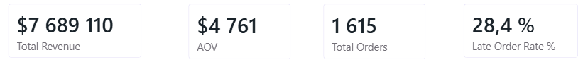
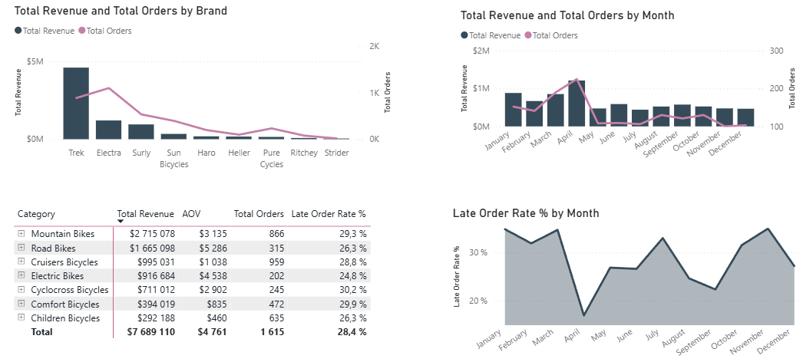
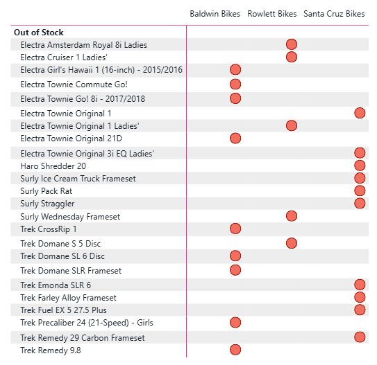

# local-bike-analytics-dbt

Modern Data Stack implementation for **Local Bike**, a bike shop aiming to become a fully data-driven company and consolidate its position as a leader in sustainable mobility.

---

## Project Purpose

Local Bike needed to move from fragmented raw data to a clean analytical layer, enabling the operations team to **optimize sales and maximize revenue** through data insights. The project covers three main analysis pillars: **Sales Efficiency**, **Staff Hierarchy**, and **Geographic Distribution**.

---

## Technical Architecture

### 1. Staging Layer — The Foundation
Mirrors the source tables with strict cleaning applied:
- **Standardization:** Renaming columns for clarity and enforcing consistent data types.
- **Privacy:** Filtering out sensitive customer information (street addresses) while retaining broad geographic data for mapping.

### 2. Intermediate Layer — The Business Logic
Where the heavy lifting happens. Three key transformations were implemented:
- **Staff Hierarchy:** A self-join logic distinguishes "Top Managers" from "Individual Contributors", enabling Power BI to drill down from a CEO view to a local mechanic.
- **Product Enrichment:** Regex cleans product names (removing year suffixes) and joins brands and categories to enable Brand Performance reporting.
- **Customer Geography:** A `geographic_location` field is constructed specifically for Power BI map visuals, combining City, State, and Zip Code.

### 3. Mart Layer — The Reporting Layer
Built as **Star Schema** components, ready for BI consumption:
- **Fact Tables:** `fct_orders` and `fct_order_items` provide granular and header-level sales data.
- **Dimension Tables:** Enriched views of Customers, Staff, Stores, and Products that provide context to the numbers.

---

## Data Lineage

---

## Power BI Data Model

---

## Dashboard & KPIs

---

## Data Quality & Testing

A robust testing suite was implemented to ensure trust in the data:
- **Business Rules:** Enforced logic such as "Shipped Date cannot be before Order Date" and ensured every active store has at least one staff member.
- **Referential Integrity:** dbt relationship tests ensure every sale is linked to a valid product and customer.
- **Custom Assertions:** Singular tests covering negative revenue, broken geographic strings, manager loopbacks, and inventory distribution logic.

---

## Stack

| Tool | Role |
|------|------|
| dbt Cloud | Transformation & Testing |
| BigQuery | Data Warehouse |
| Power BI | Data Visualization |
| GitHub | Version Control |